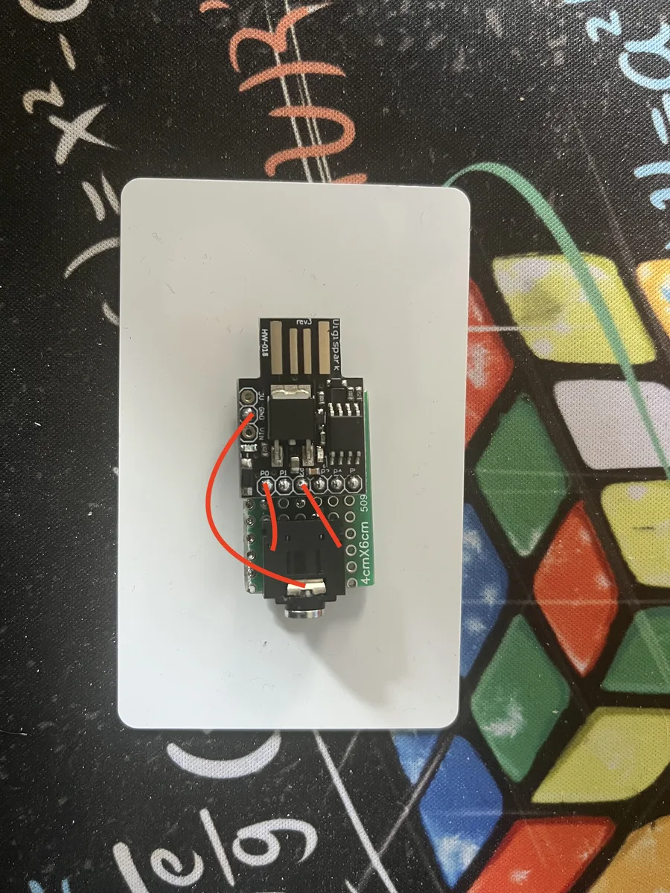
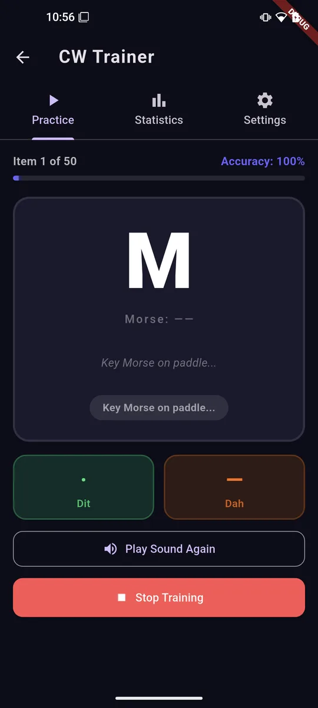
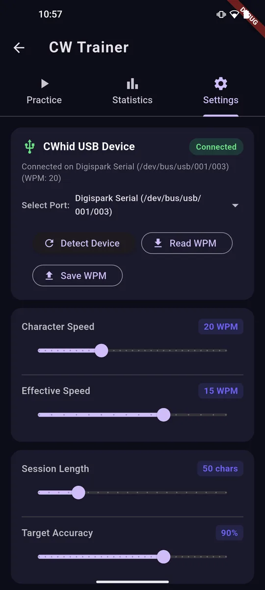

# CWhid

USB-OTG interface connecting a physical CW (Morse Code) paddle to the **AprsVector** CW training tool using a Digispark ATtiny85 microcontroller board.


---

## 🌟 Overview

**CWhid** transforms a low-cost Digispark ATtiny85 (HW-018) board into an intelligent USB CDC (Serial) Morse keyer interface. It connects directly to your physical CW paddle via a 3.5mm stereo jack, processes keystrokes using on-chip Iambic keyer logic with dot/dash memory, and sends `.` and `-` characters over USB OTG to mobile devices (Android) or PCs running the CW Trainer.

---

## 🛠️ Wiring & Connection Schema

Connecting the 3.5mm stereo jack to the Digispark ATtiny85 requires only 3 connections:



### Pinout Table

| 3.5mm Stereo Jack Contact | Digispark Pin | Microcontroller Pin | Description |
| :--- | :--- | :--- | :--- |
| **Tip** | **P0** | PB0 | **Dit (Dot)** input with internal pull-up resistor |
| **Ring** | **P2** | PB2 | **Dah (Dash)** input with internal pull-up resistor |
| **Sleeve** | **GND** | GND | Common **Ground** reference |
| *Onboard LED* | **P1** | PB1 | Visual feedback (illuminates on Dit / Dah keying) |

> [!NOTE]
> - **Pins P3 (PB3) and P4 (PB4)** are reserved for V-USB D- / D+ USB communication signals. Do not attach external connections to P3 or P4.
> - The paddle inputs use internal pull-up resistors, so key contacts simply pull P0 or P2 to GND when pressed.

---

## ✨ Key Features

- **Built-in Iambic Keyer Logic**: Full Dit/Dah latching memory for clean, timing-accurate Morse code generation on chip.
- **EEPROM Storage**: Configured speed (WPM) is stored persistently in the ATtiny85 EEPROM across power cycles.
- **Serial WPM Configuration**: Adjust keying speed (5 – 60 WPM) live via USB serial commands over CDC.
- **USB CDC Native Output**: Sends dot (`.`) and dash (`-`) symbols directly to host software over virtual COM / USB CDC interface.
- **Visual Feedback**: Onboard LED on P1 pulses during element transmission.

---

## 📱 App Integration (AprsVector CW Trainer)

CWhid integrates directly with the CW Trainer module in **AprsVector**.

| Practice Mode | Device Settings |
| :---: | :---: |
|  |  |

- Select **Digispark Serial** under settings.
- Adjust or read the WPM speed directly from the app interface.
- Practice receiving and keying Morse code in real-time.

---

## 💻 Serial Commands

You can configure keyer speed via any serial terminal or via Python script over the virtual COM port (9600 baud):

| Command | Description |
| :--- | :--- |
| `?` or `help` or `wpm` | Query current speed setting and calculated dot duration |
| `<number>` (e.g. `20`) | Set speed to `<number>` WPM (valid range: 5 to 60) and save to EEPROM |
| `wpm=<number>` | Alternative syntax for setting WPM |

### Python Helper Script

Use the included test script `test_wpm.py` to auto-detect and configure the board:

```bash
# Auto-detect Digispark and open interactive console
python test_wpm.py

# Set WPM directly
python test_wpm.py --set 25

# Run automated test suite
python test_wpm.py --test
```

---

## ⚡ Building & Flashing

This project is built using [PlatformIO](https://platformio.org/).

1. Install **PlatformIO CLI** or the VSCode extension.
2. Clone this repository and open the project directory.
3. Build & upload to Digispark ATtiny85:
   ```bash
   pio run -t upload
   ```
4. Plug in the Digispark board when prompted by the Micronucleus bootloader.
